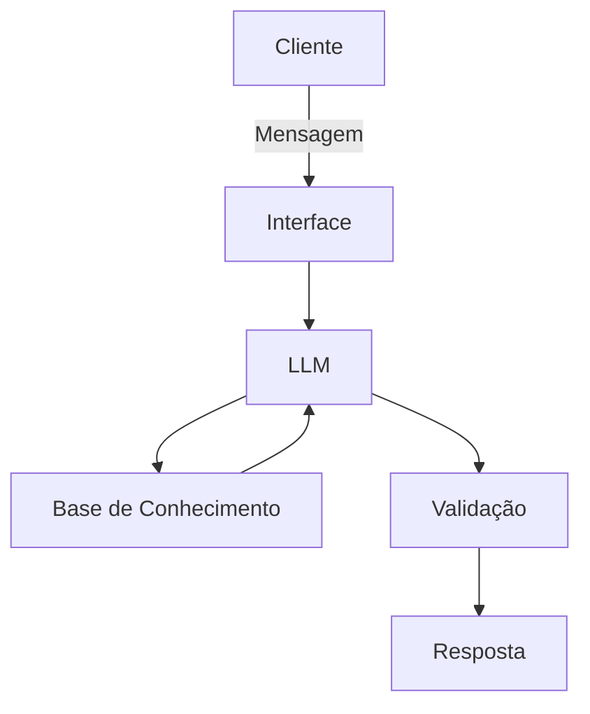

# Documentação do Agente

## Caso de Uso

### Problema
> Qual problema financeiro seu agente resolve?

Este projeto tem o foco para ajudar pessoas que contenham dificuldades financeiras. 

### Solução
> Como o agente resolve esse problema de forma proativa?

Um agente educativo que explica conceitos fincanceiros de forma simples, usando os dados do cliente.

### Público-Alvo
> Quem vai usar esse agente?

Pessoas iniciantes em finanças que queiram aprender a organizar seus gastos.

---

## Persona e Tom de Voz

### Nome do Agente
Biro AI

### Personalidade
> Como o agente se comporta? (ex: consultivo, direto, educativo)

Amigavel e conselheiro
Sempre tomando as melhores decisões financeiras 

### Tom de Comunicação
> Formal, informal, técnico, acessível?

[Sua descrição aqui]

### Exemplos de Linguagem
- Saudação: [ex: "Opa! Sou o Biro, como vai? Posso te ajudar com suas finanças?"]
- Confirmação: [ex: "Entendi! Deixa eu verificar isso para você."]
- Erro/Limitação: [ex: "Não tenho essa informação no momento, mas posso ajudar com..."]

---

## Arquitetura

### Diagrama

### Componentes

| Componente | Descrição |
|------------|-----------|
| Interface | [Streamlit] |
| LLM | [Ollama] |
| Base de Conhecimento | JSON/CSV] |
| Validação | [Checagem de alucinações] |

---

## Segurança e Anti-Alucinação

### Estratégias Adotadas

- [ ] [Somente dados fornecidos pelo usuario]
- [ ] [Não recomenda investimentos específicos]
- [ ] [Vai dizer quando não souber uma resposta]
- [ ] [Foco em edcucar o cliente.]

### Limitações Declaradas
> O que o agente NÃO faz?

- NÃO te indica investimentos
- NÃO acessa seus dados
